# Generar el deck de candidatos con Claude
*Borrador — lo revisamos aquí y una vez que quede bien lo pasamos a Google Doc.*

**Kicker:** Equipo Mandomedio
**Bajada:** Guía paso a paso para armar la presentación que se muestra al cliente — sin escribir código, sin necesitar ayuda técnica.

---

## Antes de empezar

Ya tienes todo instalado en tu computador. Cuando abras Claude vas a ver el chat, con el proyecto ya conectado. No necesitas instalar ni configurar nada.

---

> **Ojo — antes de pensar siquiera en pedirle un deck a Claude, tu screening ya debe venir armado así.** No es un paso que se hace en el momento: si tu Excel no trae esta información, Claude te la va a preguntar una por una y vas a perder tiempo respondiendo cosas que pudiste haber dejado listas desde la entrevista.
>
> **Columnas que siempre debe traer, una fila por candidato:**
>
> | Columna | Qué anotar |
> |---|---|
> | Nombre | El nombre completo de la persona |
> | Edad | |
> | Comuna | Dónde vive |
> | Título - Institución | Su título profesional y dónde lo sacó |
> | Validación de título | "Validado" si ya lo confirmaste, o "Pendiente" si no |
> | Trab. | Si está trabajando hoy (Sí / No) |
> | Cargo | Su cargo actual |
> | Empresa | Su empresa actual |
> | Pretensión de Renta | Cuánto pide ganar |
> | **Avanza a Long List** | **Sí / No — esta es la columna que decide quién sale en el deck** |
>
> **Columna "Observaciones" (texto libre):** acá va la información que no tiene columna propia. Escríbela siempre con estas mismas frases, para que Claude la reconozca:
>
> - `Renta líquida actual: [monto]` — cuánto gana hoy, si está trabajando
> - `Motivación por el cargo/cambio: [texto]` — por qué postula o se quiere cambiar
> - `Salida de [empresa]: [motivo]` — por qué dejó cada uno de sus últimos 1 o 2 trabajos (una línea por empresa)
>
> **Columnas propias del cargo:** cada búsqueda tiene requisitos distintos (por ejemplo "maneja Excel avanzado" o "ha liderado equipos de más de 10 personas"). Van en columnas propias, entre las de arriba y "Observaciones", con lo que cada candidato respondió.
>
> **Chequeo rápido antes de pedirle el deck a Claude:** cuenta los "Sí" de "Avanza a Long List" — debería ser el mismo número de CV que vas a poner en la carpeta del caso. Si no calzan, revisa antes de seguir.

---

## 1 · Prepara los documentos del caso

Junta estas 3 cosas en una carpeta nueva dentro de `casos/`: el perfil o descriptor del cargo, el screening (ya armado como se explicó arriba) y los CV de quienes avanzaron.

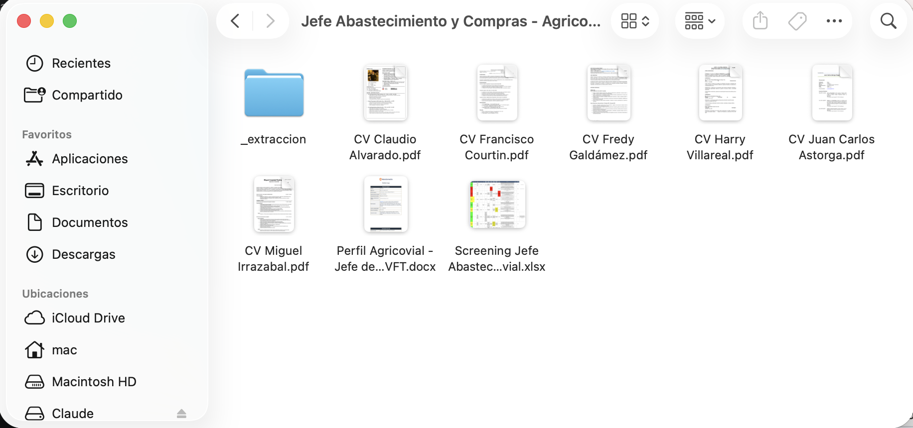
*Así se ve una carpeta de caso lista: el perfil (.docx), el screening (.xlsx) y un PDF por candidato.*

Nombra la carpeta con algo que identifique el proceso — por ejemplo `casos/gerente-finanzas-cchc/`.

---

## 2 · Pide el deck, paso a paso

### Paso 1 — Párate en la carpeta del proyecto

Al abrir Claude, haz clic en **"Proyecto o carpeta"** y busca `presentacion-candidatos`. Si no aparece en la lista, elige **"Agregar una carpeta"**.

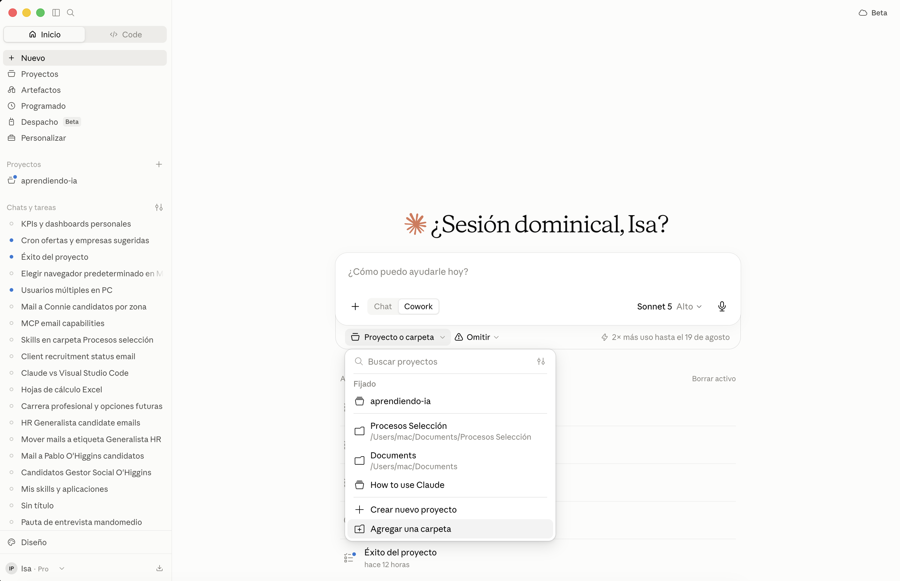

Se abre el buscador de tu computador — navega hasta la carpeta del proyecto (Documentos → presentacion-candidatos) y ábrela.

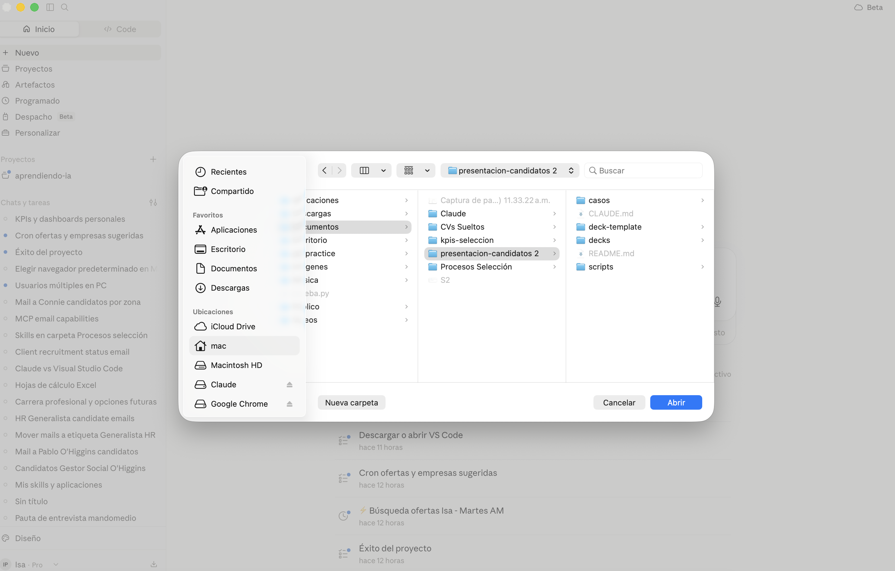

Cuando quede conectada, la vas a ver junto al cuadro de texto — ahí ya estás "parada" en el lugar correcto.

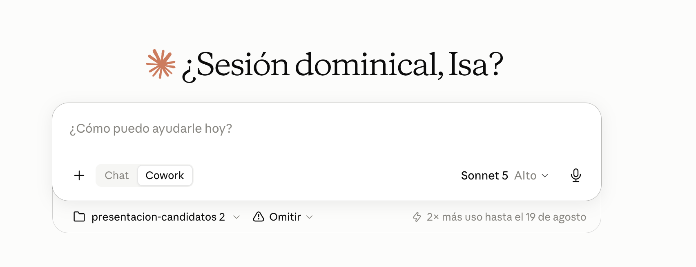

### Paso 2 — Cuéntale qué necesitas

Escribe tu pedido con tus palabras — no hay comandos que memorizar.

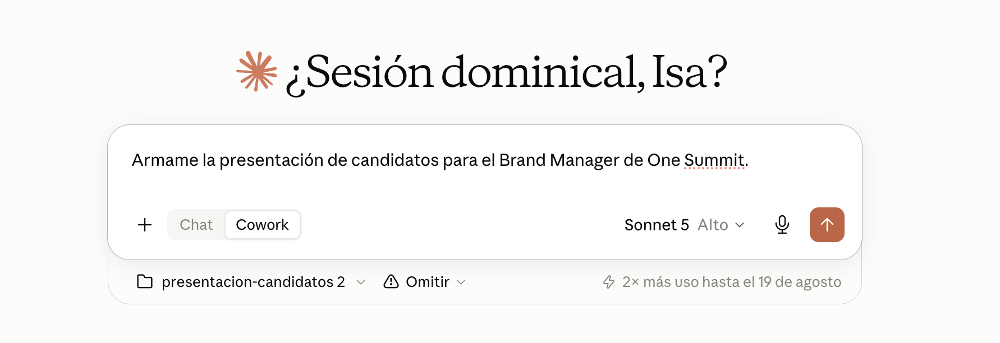
*Por ejemplo: "Armame la presentación de candidatos para el Brand Manager de One Summit."*

### Paso 3 — Deja que lea los documentos

Claude extrae el perfil, el screening y cada CV. Vas a ver mensajes cortos contándote qué está leyendo — no necesitas hacer nada acá.

### Paso 4 — Responde sus preguntas

Es la parte más importante. Antes de armar el deck, Claude pregunta lo que los documentos no traen: cuántos candidatos hubo en TOTAL en el proceso (el screening casi nunca es la lista completa), si se muestra la renta actual además de la pretensión, y con qué criterios se compara a los candidatos.

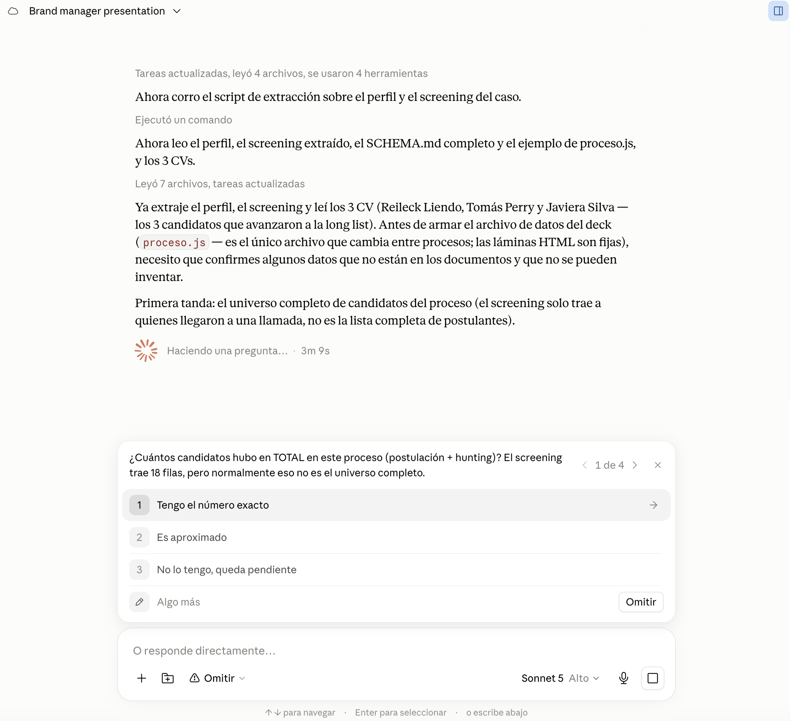
*Puedes elegir una opción, o escribir tu propia respuesta en "Algo más" — como en este ejemplo, donde se responde con el número exacto.*

Algunas preguntas te dan casillas para marcar varias a la vez, y también puedes agregar una que no esté en la lista:

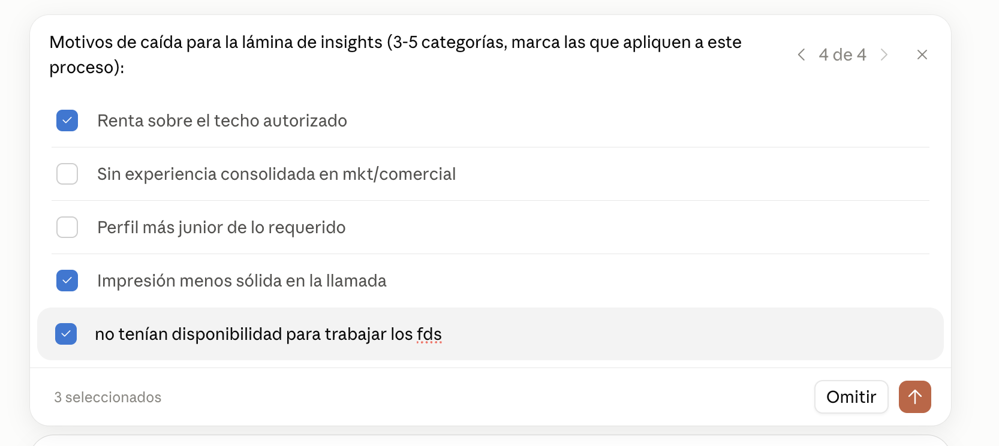

Responde con datos reales. Si no los sabes, dile que pregunte a la consultora del proceso — nunca le pidas que invente o adivine.

> **Tip:** los datos del grupo de hunting (años de experiencia, cargo, empresa) normalmente NO están en el screening — salen de tu LinkedIn Recruiter, de la base de candidatos de la búsqueda.
>
> 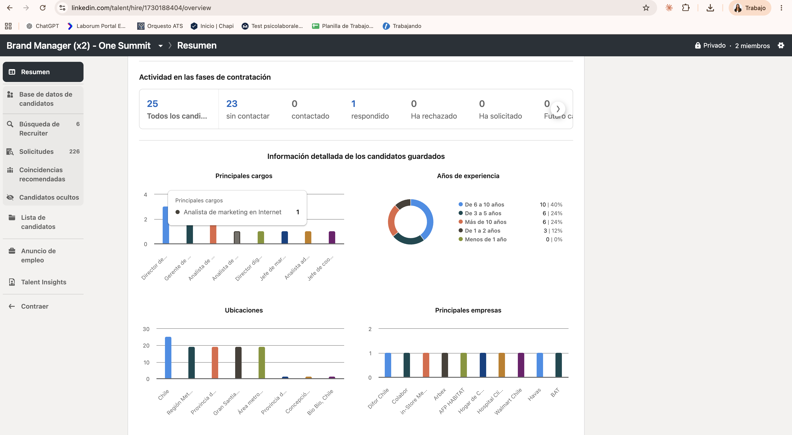

### Paso 5 — Espera mientras arma y revisa el deck

Esta parte toma varios minutos: arma cada lámina y después la revisa ella misma, en los dos temas, antes de mostrártela. A la derecha vas a ver un panel de **Progreso** con la lista de tareas, marcando cada una a medida que la termina.

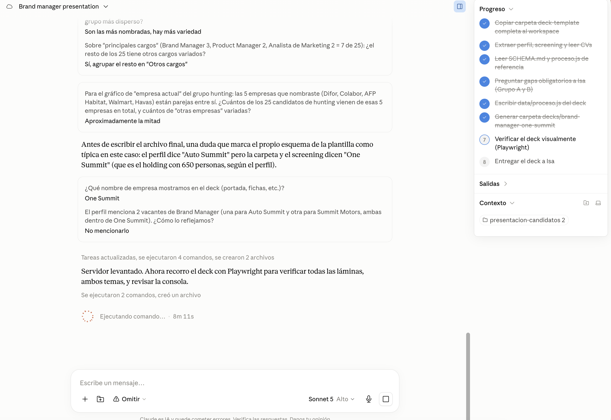

No cierres la app mientras tanto.

### Paso 6 — Recibe la ruta y ábrelo tú también

Al final Claude te dice dónde quedó guardado el deck, y si falta algún dato por confirmar con la consultora. Se guarda dentro de `decks/`, en una carpeta con el nombre del proceso.

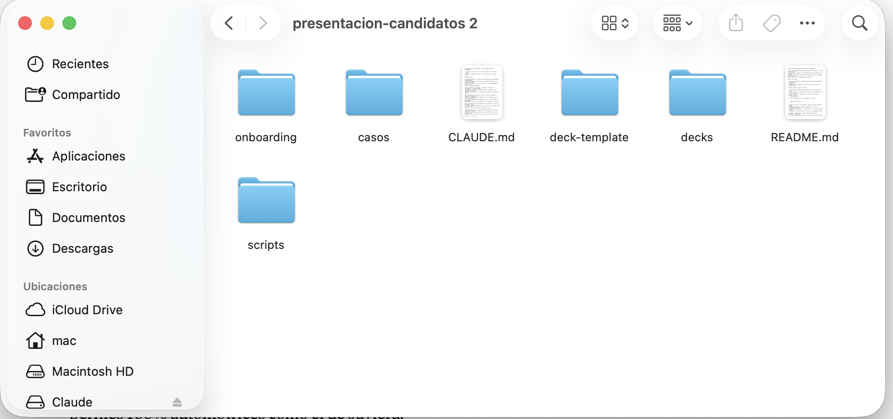

Adentro vas a encontrar `deck.html` — ábrelo con doble clic. No necesita internet ni ningún programa especial.

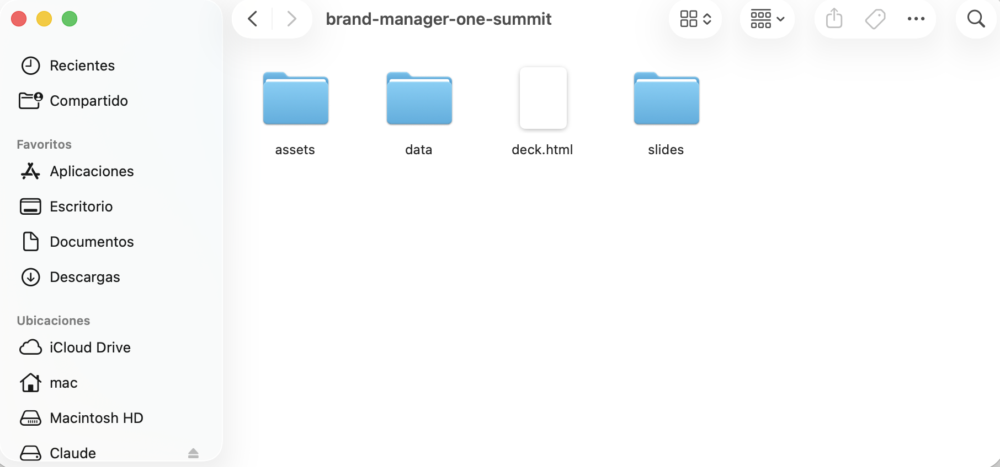

Recórrelo antes de mostrarlo al cliente.

---

## 3 · Cómo se navega el deck

| Tecla / acción | Qué hace |
|---|---|
| ← → | Avanzar y retroceder (varias láminas tienen pasos internos) |
| T | Cambiar entre tema claro y oscuro |
| F | Pantalla completa |
| Clic (en la comparativa) | Selecciona hasta 3 candidatos para verlos lado a lado — Esc limpia |
| "Ver currículum" (en un perfil) | Abre el CV encima — se cierra con ×, Esc o clic afuera |

---

## 4 · Reglas que siempre aplican

- Nunca inventes ni completes un dato que falte — Claude va a preguntar; respóndele o dile que no se sabe.
- Las fotos de candidatos solo van si la consultora las entregó para el deck — nunca sacadas del CV.
- No toques nada dentro de `deck-template/` ni de los archivos ya generados en `slides/`.
- Los documentos dentro de `casos/` son evidencia del proceso: no se editan, no se renombran, no se borran.

---

## Contacto

¿Algo no calzó, una lámina se ve rara, o Claude te pide algo que no entiendes? Escríbele a Isa o a Vicente.
